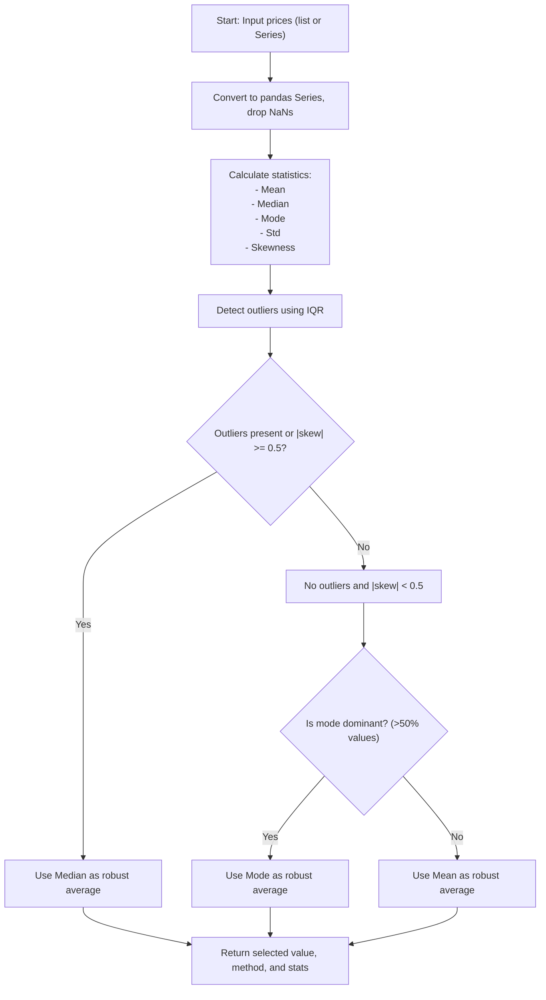

# Robust Average

A Python package that intelligently selects the most robust average (mean, median, or mode) for price analysis based on outlier and skewness detection.

## 🚀 Installation

```bash
pip install robust-average
```

## 📦 Quick Start

```python
from robust_average import robust_average

# Example with clean data
prices = [97.87, 109.99, 129.99, 89.99, 119.99]
result = robust_average(prices)
print(f"Selected average: {result['value']} (method: {result['method']})")
# Output: Selected average: 109.99 (method: mean)

# Example with outliers
prices_with_outlier = [97.87, 109.99, 129.99, 89.99, 119.99, 500.00]
result = robust_average(prices_with_outlier)
print(f"Selected average: {result['value']} (method: {result['method']})")
# Output: Selected average: 109.99 (method: median)
```

## ✨ Features

- **Automatic Method Selection**: Intelligently chooses between mean, median, or mode
- **Outlier Detection**: Uses IQR method to identify and handle outliers
- **Skewness Analysis**: Measures data distribution asymmetry
- **Transparent Results**: Returns the method used and supporting statistics
- **Business Ready**: Ensures accurate price reporting for contracts and compliance

## 🔧 How It Works

The function uses a systematic approach to select the most appropriate average:

1. **Outlier Detection (IQR Method)**:
   - Calculates Q1 (25th percentile) and Q3 (75th percentile)
   - Defines outliers as values outside [Q1 - 1.5×IQR, Q3 + 1.5×IQR]

2. **Skewness Analysis**:
   - Calculates skewness coefficient using scipy.stats.skew()
   - Values close to 0 indicate symmetric distribution

3. **Decision Criteria**:
   - **Use MEAN if**: No outliers AND |skewness| < 0.5
   - **Use MEDIAN if**: Outliers present OR |skewness| ≥ 0.5
   - **Use MODE if**: A single value appears in >50% of the dataset

### 🗂️ Process Flow



## 📚 API Reference

### `robust_average(prices, return_all_stats=False)`

**Parameters:**
- `prices` (list or pd.Series): List or Series of numeric prices
- `return_all_stats` (bool): If True, returns all computed statistics

**Returns:**
```python
{
    'value': selected_average_value,
    'method': 'mean' | 'median' | 'mode',
    'mean': mean_value,
    'median': median_value,
    'mode': mode_value_or_None,
    'std': standard_deviation,
    'skew': skewness,
    'outliers': list_of_outlier_values,
    'count': number_of_prices
}
```

## 💼 Use Cases

- **Price Analysis**: Ensure accurate average prices for reporting
- **Contract Negotiations**: Use defensible statistics in pricing discussions
- **Compliance Reporting**: Meet regulatory requirements with robust averages
- **Data Quality**: Automatically handle messy, real-world price data

## 📋 Requirements

- Python >= 3.8
- numpy >= 1.20.0
- pandas >= 1.3.0
- scipy >= 1.7.0

## 🔒 Security

This repository is designed to be public and safe. All sensitive information (API keys, tokens, etc.) is excluded via `.gitignore`.

## 📄 License

MIT License

## 🤝 Contributing

Contributions are welcome! Please feel free to submit a Pull Request.

## 📦 PyPI Package

This package is available on PyPI: https://pypi.org/project/robust-average/

## 🔗 Links

- **PyPI**: https://pypi.org/project/robust-average/
- **Documentation**: See the docstrings in the code for detailed API documentation

